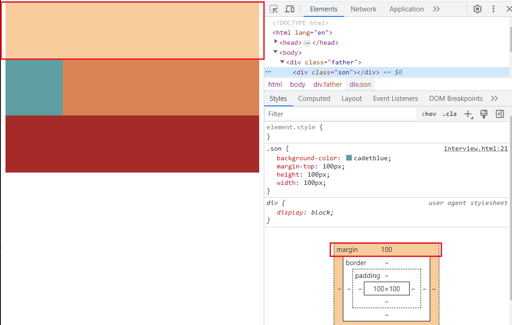

# 什么是外边距折叠
外边距折叠是指在垂直方向上相邻的两个元素的外边距会发生重叠并合并成一个较大的外边距的现象。外边距折叠只会发生在垂直方向上，而不会发生在水平方向上。外边距折叠分为父子外边距折叠和兄弟外边距折叠。

## 示例1：父子外边距折叠
```css
body {
  margin-top: 20px;
}
div {
  background-color: burlywood;
  margin-top: 100px;
  height: 50px;
}
```
  
  

从图1可以看到，body的上边距位 20px，图二中蓝色框是 body，而整个橘色部分为 100px，那么红框为 80px，也就是 div 到屏幕顶部的距离是 100px 而不是 120px，说明 body 和 div 的边距发生了重合，最终只有 100px 的高度。

## 示例2：兄弟外边距折叠
```css
.div1 {
  background-color: burlywood;
  margin-bottom: 50px;
  height: 100px;
}

.div2 {
  background-color: burlywood;
  margin-top: 100px;
  height: 200px;
}
```
  
从图3可以看到 div1 和 div2 之间的距离只有 100px，而不是 150px。

# 触发外边距折叠的条件
* 当相邻的两个元素都没有边框、内边距、行内内容、高度、最小高度等限制时  
* 都是普通流中的元素且同属于一个 BFC  
* 两个及以上垂直方向上的相邻元素（父子/兄弟）  

# BFC
可以用来清除浮动和防止外边距折叠  
* 浮动元素和绝对定位元素，非块级盒子的块级容器（例如 inline-blocks, table-cells, 和 table-captions），以及 overflow 值不为visiable 的块级盒子，都会为他们的内容创建新的 BFC（块级格式上下文）  
* 在 BFC 中，盒子从顶端开始垂直的一个接一个排列，两个盒子之间的垂直间距由他们的 margin 值决定，在同一个 BFC 中，两个相邻块级盒子的垂直外边距会产生折叠。  
* 在 BFC 中，每一个盒子的左外边缘会触碰到容器的左边缘，对于从右到左的格式来说，则触碰到右边缘。  
* BFC 可以防止元素被浮动的元素覆盖。  
* BFC 可以包含浮动的元素，防止浮动元素影响到 BFC 外部的元素。  
* BFC 内部的元素可以通过设置 overflow 属性来清除浮动。

# 如何创建一个 BFC
* float 的值不为 none
* overflow 的值不为 visible
* position 的值不为 static 或者 relative
* display 的值为 table-cell, table-caption, inline-block, flex 或 inline-flex 其中之一
* 使用多列布局(column)

# 防止外边距折叠
要防止外边距折叠只要打破触发外边距折叠的条件，因此可以从 BFC 和隔开相邻元素入手。  

## 使用 BFC
对于兄弟元素，只要保证它们不在同一个 BFC 内即可，可以给其中一个或两个套上 BFC 的外壳，对于父子元素，只要让父元素触发 BFC。  
* 使用 float 属性或 position 属性将元素脱离文档流。  
* 使用 display: inline-block 或 display: table 等属性来改变元素的显示方式。 
* 设置 overflow: hidden 

## 隔开相邻元素
* 使用内边距或边框，此方法不适用于兄弟元素，父子元素只要给父元素添加 border 或者 padding 即可  
* 增加一个空元素或使用伪元素。  

# 注意：使用 overflow: hidden 并不能直接避免兄弟元素折叠
创建了 BFC 的元素不会和他的子元素发生折叠，因此直接给两个兄弟元素添加 overflow: hidden 依然会发生外边距折叠，正确的做法应该是给两个兄弟元素分别套上两个父元素，给两个父元素添加 overflow: hidden，注意两个父元素依然会发生边距折叠。父子元素直接给父元素加上 overflow: hidden 即可避免折叠。

## 示例如下：
```html
<body>
  <div class="div1"></div>
  <div class="div2"></div>
</body>
<style>
  .div1 {
    background-color: brown;
    margin-bottom: 100px;
    height: 100px;
    overflow: hidden;
  }

  .div2 {
    background-color: cadetblue;
    margin-top: 100px;
    overflow: hidden;
    height: 200px;
  }
```
  
从上图可以看到，依然发生了外边距的折叠。  

## 正确做法如下：
```html
<body>
    <div class="div1"><div></div></div>
    <div class="div2"><div></div></div>
</body>
<style>
  .div1 {
    margin-bottom: 100px;
    height: 100px;
    overflow: hidden;
  }
  .div1 > div {
    background-color: brown;
    margin-bottom: 50px;
    height: 50px;
  }

  .div2 {
    overflow: hidden;
    height: 200px;
  }

  .div2 > div {
    background-color: cadetblue;
    height: 100px;
    margin-top: 100px;
  }
```
  
如上图所示，根据整个 body 的高度为 400px 可以算出红色和蓝色之间的距离为 250px，没有发生外边距折叠。因此 BFC 只能直接解决父子元素的折叠
，不能直接解决兄弟元素的折叠。所以不能滥用 BFC，应该根据需要选择合适的方法。